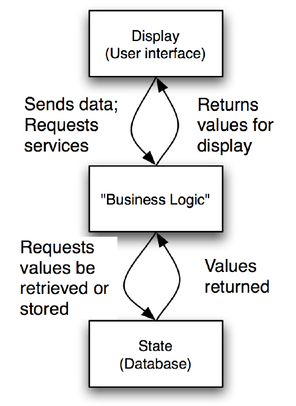
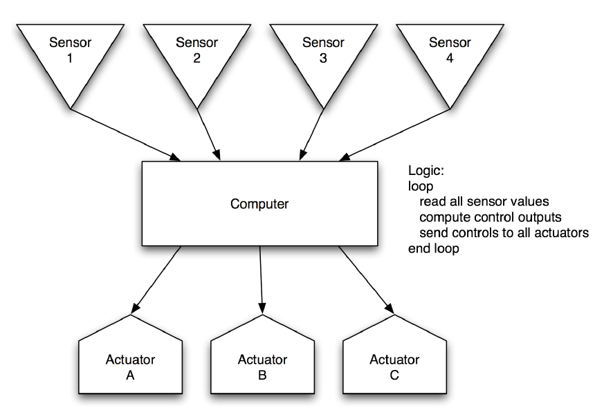
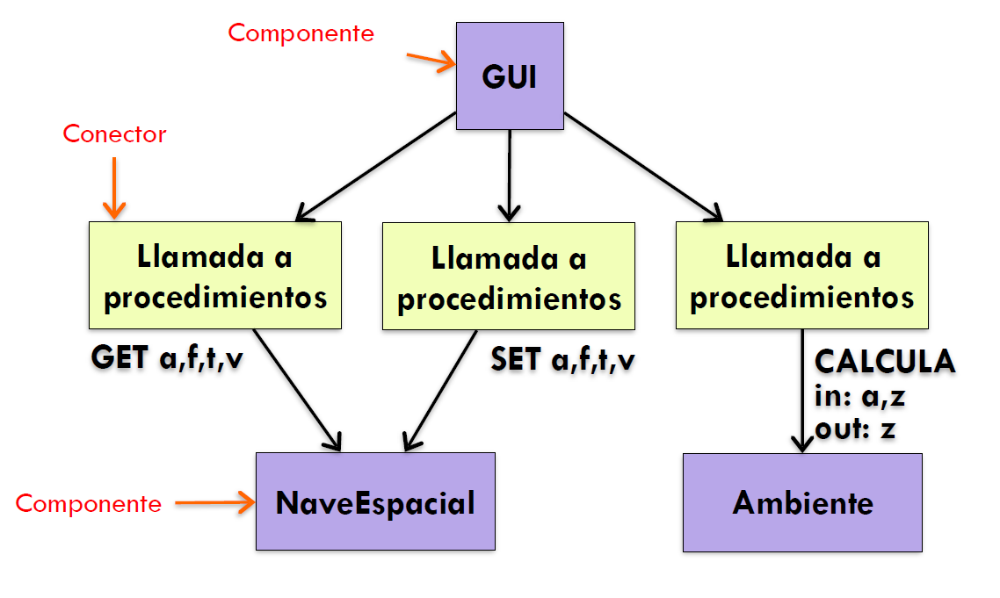
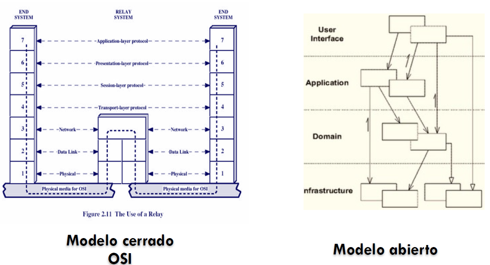
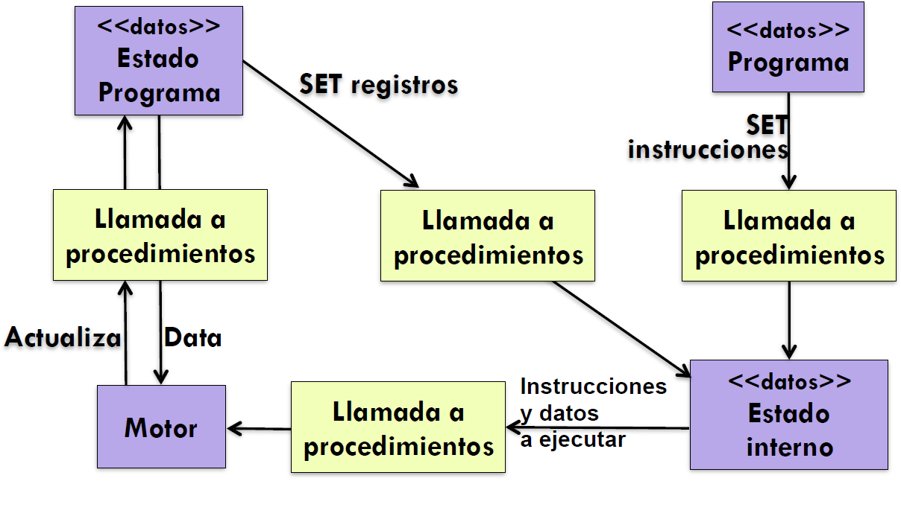
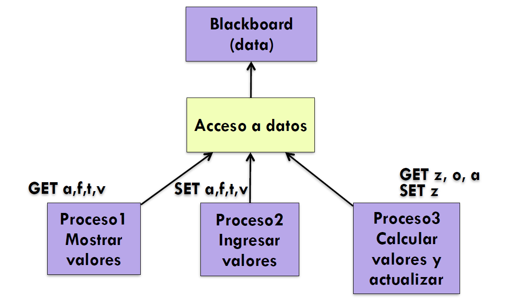
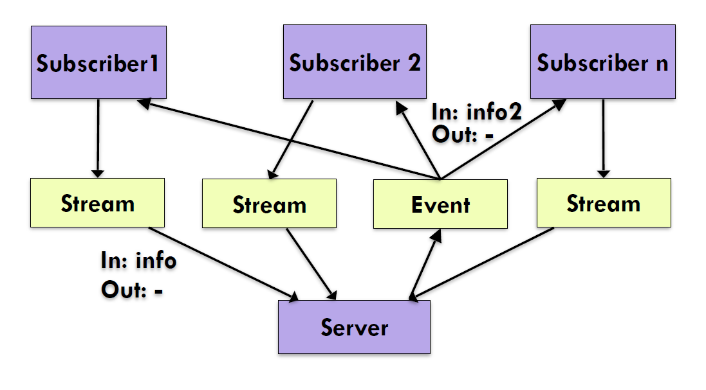
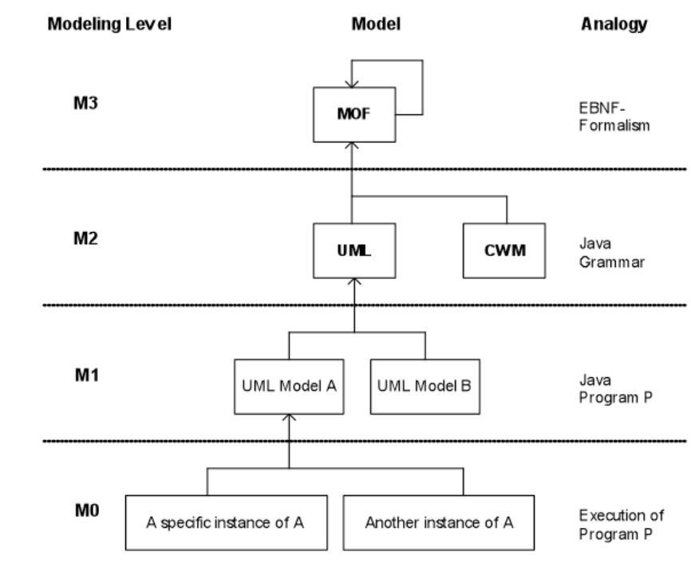
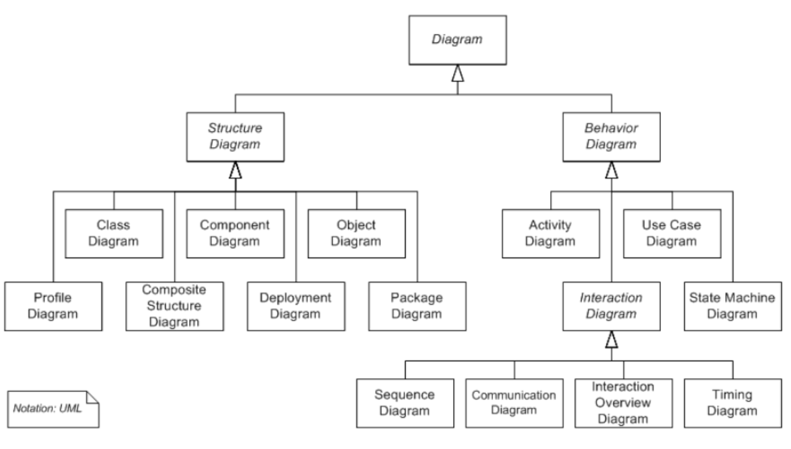
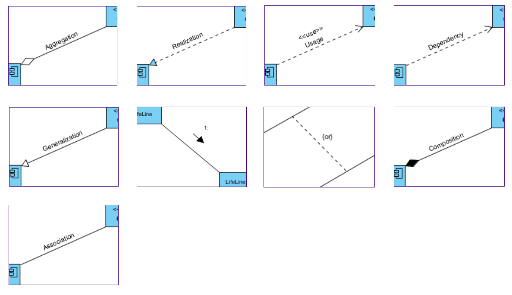

# Clase 1 - Introducción

## ¿Por qué este ramo?

Aumenta la **comlejidad** del software actual.

Existe conocimiento de arquitecturas de **referencia**, **frameworks** y **patrones** para usar como base y mejorar la calidad de diseño.

Garantizar **calidad**, reducir costos y permitir **felxibilidad**

## Motivación

Típicamente los sistemas de desarrollo atienden intereses puntuales
* Lista de requisitos/requerimientos
* Modelo de dominio
* Desarrollo de software

Aparecen cambios 
* Modificaciones
* Adaprtaciones
* Extensiones
* Parches
* ...

Esto hace que se quede software inutuilizado, repetido o que se generen muchas dependencias y no siempre funcionan correctamente

## Problemas de la Ingeniería de Software

### Accidentales

* Existe una solución... hay que encontrar una solución "elegante"
* Mejora de productividad
    * Programación y abstracciones: lenguajes de programación de alto nivel
    * Resultados de las decisiones de programación toma mucho tiempo
    * Programas heterogéneos
        * IDEs
        *Apoyo al desarrollo

### Esenciales

* Solo existen soluciones parciales
    * Complejidad
        * Crece de manera no lineal
    * Conformidad
        * Sistema operativo, hardware, ...
    * Cambiabilidad (adaptabilidad)
        * Nuevas aplicaciones, usuarios, náquibas, estándares, leyes, hardware, ...
    * Intangibilidad
        * No hay leyes físicas, no hay una percepción obvia

## Arquitectura de Software

Conjunto de las **principales** decisiones de diseño sobre el sistema
* Estructura
* Conducta
* Iteración
* Propiedades no funcionales

Son decisiones que afectan *todo el sistema*

No se especifican detalles -de implementación- pero si los componentes que cargan con la responsabilidad de la implementación
    * Componentes de grano grande y subsistemas, no clases ni algoritmos

Va del análisis a la implementación

El objetivo es manejar la complejidad y cumplir con los *atributos de calidad*

Tomar decisiones que afectan a todo el sistema

Considera:
* Elementos -> qué
* Forma -> cómo
* Logica -> por qué

Involucra:
* Elementos a partir de los cuales se constuye un sistema
* Interacciones entre los elementos
* Patrones que guían su composición
* Restricciones sobre esos patrones
* Abstracciones, de-composición, compocisión, estilo y esética

"La organización fundamental de un sistema se ve reflejada en sus componentes, relaciones enrtre ellos y el ambiente y los principios que gobiernan su deiseno y evolución" (Recommended Practice for Architectural Description of Software-Intensive Systems ANSI/IEEE Std 1471-2000)

Captura la *estructura* del sistema en términos de componentes y cómo interactúan

Define las reglas de diseño y evolución globales al sistema

Componentes, módulos, objetos o cualquier otra unidad de software interrelacionada

## Principios

* **Cohesión**
* **Acomplamiento**
* Consistencia
* YAGNI (you aren't going to need it)
* KISS (keep it simple and stupid)
* Calidad
* Testing
* Diseño (frameworks, patrones, etc)
* ...

### Cohesión

La funcionalidad relacionada debe ir junta, dentro de un módulo

Las partes dentro de un módulo deben trabajar juntas

### Acomplamiento

Interdependencia entre módulos

### Capas de abstracción

## Roles del arquitecto

* Juntar requisitos
* Documentar
* Diseñar
* Comunicar
* Liderar el desarrollo

Las mejores arquitecturas son producto de
* Solo una mente
* Un equipo pequeño y estrtucturado (Rechtin, Systems Architecting: Creating & Building Complex Systems, 1991, p21)

Todo proyecto debe tener exactamente un arquitecto identificable (un responsable)
* Para proyectos más grandes, el arquitecto principal debe/puede estar respaldado por un arquitecto o subequipo

### Habilidades esperadas

* Capacidad de desarrollo de software (experto)
* Expertiz en el dominio (experto en el tema)
* Comunicador
* Estratega
* Consultor
* Líder
* Tecnólogo
* Estimador de costo
* Animador/ motivador
* Político
* Vendedor

### Arquitecto como desarrollador

Debe entender las dificultades del desarrollo de software
* Principios
* Métodos y técnicas
* Metodologías
* Herramientas

Debe entender las ramificaciones de las decisiones arquitectónicas
* No debe viivir en una "torre de marfil"
* Restricciones (de implementación) de sus decisiones

### Arquitecto como experto del tema

No basta con que sea un buen programadro

Problemas con el dominio del tema
* Madurez
* Estabilidad
* Usuarios y sistemas

Puede afectar de fran manera a la arquitectura diseñada y la implementación de la solución
* Capacidad de escalar
* Capacidad de evolución
* ...

Requiere de artefactos para entender el problema
* No la solución

### Arquitecto como estratega

Desarrollar una arquitectura "elegante" no es suficiente
* La tecnología es solo una parte de la solución
* La arquitectura debe ser adecuada para la organización

Debe ajustarse a la organización
* Estrategia de negocios
* A las prácticas del negocio
* A los ciclos de planificación
* Debe ajustarse (o funcionar bien) con los procesos del negocio

Debe estar consciente de la competencia
* Productos
* Estrategias
* Procesos

### Arquitecto como comunicador

Es casi la mitad del trabajo

Debe
* Escuchar las preocupaciones de los Stakeholders
* Explicar la arquitectura de la solución
* Negociar compromisos y fechas

Necesita las capacidades para
* Escribir bien
* Hablar (convencer)
* Presentar

### Arquitecto como líder

Debe ser un líder técnico
* En base a su conocimiento y sus logros
* Inspira respeto a través de sius ideales, epertiz, palabras y acciones
* No puede apoyarse solo en su disposición en el organigrama

Asegurar que se sigan las reglas, guías y decisiones de diseño

Mejorar la productividad y calidad al agregar/incorporar
    * Nuevas ideas, soluciones y técnicas
    * Mentores y nuevas personas al proyecto

Tomar decisiones y ayudar en asegurar la implementación

### Arquitecto como tecnólogo

Entender los enfoques de desarrollo
* Basado en objetos y componentes

Entender las tecnologías fundamentales
* Redes y sistemas operativos
* Middleware
* Seguridad
* Bases de datos
* Interfaces gráficas (GUI)

Estar al día con las corrientes

Demostrar expertiz en
* Modelar el sistema
* Análisis de trade-off de la arquitectura
* Amarrar requerimientos de sistema a la solución arquitectónica

### Arquitecto como estimador de costos

Entender las ramificaciones financieras de las decisiones arquitectónicas
* Green field vs Brown field
* Costo de adoptar COTS
* Costo de desarrollar para el reuso
* Estabilidad financiera y posición de la compañia en el rubro

La solución tecnológica superior no siempre es la más apropiada
* Impacto en el costo y en el cronograma

Aproximaciones de estimaciones de costos son suficientes (en general)
* Se puede entrar en mayor detalle cuando las opciones se han reducido a un pequeño grupo

### Arquitecto como vendedor

Por las razones anteriores, el arquitecto debe vender:
* La visión general
* La solución tecnológica
* Principales propiedades arquitectónicas
* Principales propiedades del sistema que se obtendrá
* Perfil de costos y cronogramas
* Importancia de apegarse a la arquitectura

## Rol del equipo de arquitectura

Definit la arquitectura de software

Mantener la integridad de la arquitectura de software

Explorar y mitigar los riesgos asociados al diseño

Propones orden y contenidos de las iteraciones

Coordinar y co-existir con otros equipos

Asistir en las decisiones del proyecto

Asistir en las definiciones del proyecto

# Clase 2 - Requisitos no funcionales (NFR)

## Diseño de la arquitectura de software

1. Identificar **requisitos no funcionales** (atributos de calidad) y restricciones
2. Diseñar y/o elegir un framework/metáfora/estilo
3. Validar
4. Documentar decisiones de diseño

## NFP: non functional properties

Las propiedades no funcionales (atributos de calidad) son el resultado de las decisiones de arquitectura

Los requisitos no funcionales, son los "valores" que se esperan de dichas propiedades

Atributos ejemplo:

| Atributo de calidad | Requisito arquitectónico |
|---------------------|--------------------------|
| Desempeño | La aplicación debe entregar tiempos de respuesta menores a 4 segundos para el 90% de las solicitudes |
| Seguridad | Toda comunicación debe ser autenticada y encriptada usando certificados |
| Gestión de recursos | El servidor debe correr como un proceso no prioritario en un PC con 512MB de memoria |
| Usabilidad | La interfaz de usuario debe correr en un browser de Internet para los usuarios remotos |
| Disponibilidad | El sistema debe correr 24x7x365, con una disponibilidad promedio de 0.99 |
| Confiabilidad | No se acepta pérdidad de mensajes, el resultado de la entrefa de mensajes debe conocerse en 30 segundos |
| Escalabilidad | La aplicación debe manejar na carga *peak* de 500 usuarios concurrentes durante el periodo de inscripción |
| Flexibilidad | La arquitectura debe permitir una migración en fases del lenguajr 4GL a .NET |

Restricciones ejemplo:

| Restricción | Requisito arquitectónico |
|-------------|--------------------------|
| Negocio | La aplicación debe correr como un plugin para MS Biz Talk |
|| Queremos aliarnos (y obtener fondos) de Xcorp |
| Deasarrollo | El sistema debe estar escrito en Java |
| Tiempo | La primera versión debe entregarse en 6 meses |

## Atributos de calidad

### Performance - Desempeño

Carga del trabajo que una aplicación debe ejecutar en una unidad de tiempo y/o deadlines que debe cumplir para una correcta operación

* Throughput - salida: carga de trabajo en una unidad de tiempo (transacciones por segundo - tps). Peak y promedio
* Tiempo de respuesta: latencia que una aplicación exhibe al procesar una carga de trabajo. Garantizado (límite) y promedio
* Deadline - plazo: ventana de tiempo para la comleción de una carga de trabajo

### Escalabilidad

¿Qué tan bien trabaja una solución cuando el tamaño del problema aumenta?

* Request - cantidad de solicitudes: multi thread, balance de carga (repartir las solicitudes entre varios sevidores/CPUs)
* Cantidad de conexiones concurrentes
* Tamaño de datos: cantidad de datos que puede procesar la aplicación en cada transacción (incremento en el tamaño de los paquetes de datos)
* Deployment - implantación: cantidad de esfuerzo requerido en distribuir, actualizar, configurar una aplicación (incremento en cantidad de usuarios)

### Integración 

Esfuerzo requerido para integrar una aplicación en un contexto mayot

* A nivel de datos (DB accesible a otras aplicaciones)
    * Flexible, simple y peligrosa
* API (Application Programming Interface) 
    * Conjunto de funciones (parametrizadas) que controlan el acceso a los datos. Garantizan integridad de datos y reglas de negocio
    * Compleja, costosa y segura

### Flexibilidad

Esfuerzo requerido para cambiar una aplicación (modificar funcinalidad o arquitectura)

* Requiere identificar esxenarios de cambios probables
* Cohesión dentro de los componentes y subsistemas débilmente acoplados facilitan el cambio

### Seguridad

* Autenticación, autorización, encriptación, integridad, no repudiación

### Disponibilidad

Porcentaje de tiempo en que una aplicación puede ser usada

* Recuperación ante fallas (automática o manual)

## Factores y métricas de calidad

| Métrica | Definición | Factor |
|---------|------------|--------|
| Accuracy | Grado en el cual un programa satisface su especificación y cumple los objetivos del usuario. ¿El producto hace lo esperado? | Trace-ability, completeness, consistency |
| Reliability | Gradoen el que un programa cumpla sus funciones con precisión. ¿Cómo satisface los requisitos dado un periodo de tiempo? | Consistency, accuracy, error tolerance, simplicity |
| Efficency | Cantidad de recursos computacionales y código requerido para que el programa cumpla sus funciones. ¿Utiliza los recursos de hardware bien? | Execution, efficiency, storage efficiency |
| Integrity | Grado en el cual el acceso a datos o software por personas no autorizadas puede ser controlado. ¿Es seguro? | Acces control, acces unit |
| Usability | Esfuerzo requerido para aprender, operarm ingresar daros e interpretar la salida de un programa. ¿Puedo manejarlo fácilmente? | User friendly, operability, training |
| Maintainability | esfuerzo requerido en ubicar y arreglar un error ¿Puedo corregir una falla fácilmente? | Readability and code structure, modularity, consistency, simplicity, documentation |
| Testability | ¿Puedo probar el producto sin añadir costo adicional después de hacer cambios? | Simplicity and code struture, modularity, instrumentation, documentation |
| Interoperability | Esfuerzo requerido para unir dos sistemas. ¿Puedo crear una interfaz con otros sistemas? | Modularity, compatibility |
| Flexibility | Esfuerzo requerido para modificar un programa. ¿Puedo ejecutar un cambio fácilmente? | Modularity, simplicity od design and code, generality, quality of documentation |
| Portability | Esfuerzo para transferir un programa de una configuración de hardware y/o ambiente a otro. ¿Puedo usar el programa en otro hardware? | Modularity, quality of documentation, software system independence |
| Reusability | Grado en el cual un programa puede ser usado en otras aplicaciones. ¿Puedo uasr partes de la aplicación en otros programas? | Simplicity and code structure, modularity, quality and availability of documentation, software system independece, machine independence |

## Atributos de calidad - Interesados

### Usuario final
* Performance
* Availability
* Usability
* Security

### Desarrollador
* Maintainability
* Portability
* Reusability
* Testability

### Negocios - Stakeholders

* Time to market
* Cost and benefits
* Project life time
* Targeted market
* Integration with legacy system
* Roll back schedule

## Atributos de calidad - Producto

### Revisión
* Maintainability
* Flexibility
* Testability

### Transición
* Portability
* Reusability
* Interoperability

### Operación
* Correctness
* Reliability
* Usability
* Integrity
* Efficiency

# Clase 3 - Elementos básicos: patrones y estilos

## Elementos fundamentales

* Componentes
* Conectores
* Datos
* Configuraciones

## Componente

Entidad arquitectónica que encapsula un subconjunto de la **funcionalidad** y/o **estado** del sistema

Restringe el acceso a ese subconjuntoa través de una **interfaz** definida explicitamente

Tiene dependencias explicitamente definidas sobre su **contexto de ejecución**

* Interfaz con otros componentes, recursos, software de sistema o hardware

## Conector

Elemento arquitectónico encargado de efectuar y regular las interacciones entre componentes
* Llamadas a procedimientos
* Acceso a memoria compartida
* Paso de mensajes
* Streaming
* Acceso acomponentes distribuidos
* Wrapper/adaptador

## Configuración arquitectónica o topología

Conjunto de asociaciones específicas entre componentes y conectores

## Patrones, estilos y DSSAs

### Estilo arquitectónico

Colección nombrada (con nombre) de **decisiones** de diseño arquitectónico que:
* Se aplican a un contexto de desarrollo dado
* Restringen las decisiones de diseño que son específicas a un sistema particular dentro de ese contexto
* Obtiene las ventajas de cada sistema resultante

### Patrón arquitectónico

Colección nombrada de decisiones de diseño arquitectónico aplicadas a un problema de diseño recurrente que se parametriza según los contextos de desarrollo en que aparece el problema

Diferencias con estilo arquitectónico:
* Alcance: contexto de desarrollo (estilo-estratégico), problema de diseño (patrón-táctico)
* Abstracción: requiere interpretación humana (estilo), fragmentos arquitectónicos parametrizados
* Relación: un patrón puede aplicarse a sistemas que siguen varios estilos, un sistema que sigue un estilo puede usar varios patrones

## Ejemplos de patrones

### Patrón modelo - vista - controlador (MVC)

Objetivo: separar la información, presentación e interacción del usuario.

* Cambia el modelo: enviar notificación a la vista y al controlador
* Las acciones del usuario (interfaz) generan un evento que se envía al controlador que a su vez actualizará el modelo

### Patrón Estado - lógica - presentación (3 capas)

Objetivo: separación entre estado, presentación y funcionalidad

### Patrón sensor - controlador - actuador

Objetivo: separar la captura de infromación (leer), del procesamiento y de la manipulación de objetos (actuar)

## Estilo arquitectónico

Colección nombrada (con nombre) de **decisiones** de diseño arquitectónico que:
* Se aplican a un contexto de desarrollo dado
* Restringen las decisiones de diseño que son específicas a un sistema particular dentro de ese contexto
* Obtiene las ventajas de cada sistema resultante

### Propiedades básicas del estilo arquitectónico

Vocabulario de **elementos** de diseño
* Tipos de conectores, componentes y elementos de datos

Conjunto de reglas de **configuración**
* Restricciones topológicas que determinan cómo pueden componerse los elementos

Interpretación semántica
* Las composiciones tienen un significado bien definido
* Es posible analizar los sistemas creados

### Beneficios del estilo arquitectónico

Reuso de diseño
* Soluciones bien entendidas aplicadas a nuevos problemas

Reuso de código
* Implementación compartida de los aspectos invariantes de un estilo

Facilita la comprensión de la organización del sistema
* Ej: "Cliente - Servidor" ya indica cómo es el sistema

Interoperabilidad
* Debido a la estandarización del estilo y su mayor comprensión

Análisis específico al estilo
* permite restringir el espacio de diseño

Visualizaciones
* Figuras específicas al estilo calzan con el modelo mental ingenieril

### Estilos comunes

1. Influenciados por el lenguaje
    1. Main y sub rutinas
    2. Orientado al objeto
2. En capas
    1. Máquinas virtuales
    2. Cliente servidor
3. Flujo de datos
    1. Por lotes, secuencial
    2. Tuberías y filtro (pipe & filter)
4. Memoria compartida
    1. Pizarra
    2. Basado en reglas
5. Intérprete
    1. Intérprete
    2. Código móvil
6. Invocación implícita
    1. Basado en eventos
    2. Publisher-Suscribe
7. Peer to peer
8. Derivados
    1. C2
    2. Corba

### Estilo: Orientado al objeto

Vocabulario
* Componentes: objeto (data + operaciones)
* Conectores: mensajes e invocación de métodos

Invariante del estilo
* Los objetos son responsables de la integridad de su representación interna
* La representación interna se oculta a otros objetos

Ventajas
* Maleabilidad infinita de la implementación interna del objeto
* Descomposición del sistema en conjuntos de agentes que interactúan

Desventajas
* Objetos deben conocer las identidades de los servidores
* Hay efectos secundarios en las invocaciones de los métodos

### Estilo: En capas

Componentes
* Capas: cada capa expone una interfaz (API)
* Modelo cerrado: capas, rol servidor (proveedor para capas superiores), rol cliente  (consumidor de capas inferiores)

Conectores
* Protocolos de interacción entre capas

Ventajas
* Aumentan los niveles de abstracción
* Evolución y reuso: cambios en una capa afectan solo a las capas adyacentes
* Se pueden tener diferentes implementaciones de una capa manteniendo la interfaz
* Pueden definirse interfaces estandarizadas para librerías y frameworks

Desventajas
* No es aplicable universalmente
* Desempeño: saltarse capas, nivel de abstracción correcto

1. Máquinas virtuales

* Componentes: programas (subcomponentes) a ser ejecutados, motor de ejecución, estado (datos) de los programas, estados (datos) internos del motor
* Conectores: llamada a procedimientos
* Topología: capas cerradas o grafo acíclico dirigido (DAG)
* Ventajas: portabilidad
* Desventaja: difícil de implementar

2. Cliente Servidor

* Componentes: clientes y servidores
* Servidores deconocen a los clientes y su número
* Clientes conocen la identidad del sevidor
* Los clientes no pueden hablar con otros clientes
* Conectores: protocolo basado en RPC

RPC: remote procedure call (RPI: Invocation)
* Cliente invoca un método o procedimiento que se ejecuta remotamente y se queda esperando la respuesta
* Cliente debe saber cómo hacer esa llamada
    * Conoce la interfaz del procedeimiento (parámetros y tipos) y empaqueta (marshalling) y desempaqueta (unmarshalling) los mensajes
    * Conoce la dirección del servidor

### Estilo: Flujo de datos

Por lotes, secuencial

* Componentes: programas separados se ejecutan en orden
* Conectores: personas (sneaker-net), sistemas de mensajería, colas, etc.
* Elementos de datos pasados explícitamente al programa
* El "abuelo" de los estilos arquitectónicos

Pipe & Filter

* Componentes:
    * Filtros: transforman los flujos de datos de entrada en flujos de salida
    * Posiblemente producen salida incrementalmente
* Conectores: Pipes conducen los datos
* Invariantes:
    * Filtros son independientes (no hay estado compartido)
    * Los filtros no conocen la direccionalidad de las tuberías (pipes)
* Variaciones:
    * Pipelines: secuencias lineales de filtros
    * Pipelines acotados: se limita a la cantidad de datos del pipe
    * Pipes tripificados: data fuertemente tipificada
* Ventajas:
    * Añadir, reemplazar y reusar filtros
    * Análisis
    * Ejecución concurrente
* Desventajas:
    * Requiere organización del procesamiento
    * No soporta aplicaciones interactivas
    * Mínimo común denominador en la transmición de datos

### Estilo: Memoria Compartida

Pizarra (blackboard)

* Componentes:
    * Estrucura de datos compartidas (pizzarra)
    * Componentes que operan sobre la pizarra
* El estado de la pizarra controla el flujo de ejecución
    * AI
    * Circuitos integrados
    * Compiladores

Basado en reglas

* Un motor de inferencia parsea las entradas de los usuarios y determina si es un hecho, una regla (y los añada a la base de conocimientos) o una consulta (y la resuelve)
* Los hechos y reglas se añaden a la base de conocimiento
* Las consultas se ejecutan sobre la base de conocimiento para evaluar las reglas que se puedan aplicar y resolver la consulta
* Componentes: interfaz de usuario, motor de inferencia, base de conocimiento
* Conectores: componentes fuertemente interconectados vía llamadas a procedimientos y/o llamadas a memoria compartida
* Elementos de datos: hechos y consutas
* Riesgo: al aumentar el número de reglas es muy dificil entender las interacciones entre las reglas

### Estilo: intérprete

El intérprete parsea y ejecuta comandos de entrada, actualiza el estado mantenido por el intérprete

Componentes: intérprete de comandos, programa de interpretación del estado, interfaz de usuario

Conectores: llamadas a preocedimientos y estado compartido

El conjunto de comandos se modifica en tiempo de ejecución

La arquitectura permanece constante

Programación de interfaz de usuario

### Estilo: código móvil

Un elemento de datos se transforma dinámicamente en un componente de procesamiento de datos

Componentes: puerto de ejecución, maneja la recepción del código y del estado, compilador de código / intérprete

Conectores: protocolos de red y elementos para empaquetar código y datos para transmisión

Elementos de datos: representaciones de código como datos; estado del programa y datos

Variantes:
* Codigo bajo demanda
* Evaluación remota
* Agentes móviles

### Estilo: invocación implícita

Anuncio de eventos en lugar de innovación de métodos

Componentes:
* Listeners registran el interés en algún componente y asocian métodos a eventos
* Los métodos se registran de manera implícita
* Interfaces de componentes son métodos y eventos

Conectores: invocación explícita e implícita en respuesta a eventos

Invariantes del estilo:
* Publicadores no conocen los efectos de los eventos
* No se asume cómo se procesará la respuesta a eventos

Ventajas: reuso de componentes, evolución del sistema (desarrollo y ejecución)

Desventajas:
* Estructura de sistema no es intuitiva
* Componentes no permiten control del sistema
* No hay conocimiento de la respuesta de los componentes al evento, ni del orden de las respuestas

Publisher - subscriber:

* Subscriptores se registran / de-registran para recibir mensajes específicos o contenido específico
* Publicadores difunden mensajes a subscritores de manera asíncrona
* Topología: subscriptores conectan a publicadores directamente o reciben notificaciones vía protocolo de red de intermedios
* Componentes: publishers, subscribers, proxies
* Conectores:
    * Protocolo de red
    * Conectores especializados para subscripción basada en contenido
* Elementos de datos: subscripciones, notificaciones, información publicada
* Altamente eficiente para diseminación de contenido en una dirección con componentes de muy bajo acoplamiento

### Estilo: invocación implícita

Basada en eventos

* Componentes independientes emiten y reciben eventos asíncronamente sobre buses de eventos
* Evento: cambio significativo de estado

* Componentes: generadores y/o consumidores de eventos independientes y concurrentes
* Conectores: buses de eventos
* Elementos de datos: datos enviado sobre el bus
* Topología: los componentes se comunican mediante los buses de eventos, no directamente unos con otros
* Variaciones: 
    * Push: los componentes reciben los datos de los buses (son empujados hacia ellos)
    * Pull: los componentes sacan los datos de los buses (tiran de ellos)
* Altamente escalable, fácil de evolucionar, efectivo, por aplicaciones altamente distribuidas

### Estilo: Peer to Peer

Estado y conducta se distribuyen entre peers (pares) que actúan como clientes o servidores

Componentes: 
* Peers: Componentes independientes tienen un estado propio y controlan su hilo de ejecución

Conectores:
* Protocolos de red (a veces ad-hoc)

Elementos de datos:
* Mensajes de red

Topología:
* La red puede tener conexiones redundantes entre los peers
* Puede variar arbitrariamente en tiempos de ejecución

Computación descentralizada:
* Flujo de control y recursos están distribuidos entre pares
* Altamente robusto ante fallas de algún nodo
* Escalable en cuanto a acceso a recursos y procesamientos
* Protocolo complejo

## ¿Cuándo usar qué?

| Estilo | Procesamiento | ¿Cuándo sí? | ¿Cuándo no? | Impacto en calidad |
|--------|---------------|-------------|-------------|--------------------|
| Influenciado por el lenguaje | El orden del procesamiento es conocido o los componentes esperan la respuesta de otros componentes para continuar |
| Main y subrutinas | El problema puede descomponerse en problemas pequeños | Aplicación es pequeña y simple | Se requieren estructuras de datos complejas. Se modificará | Performance, reusabilidad |
| Orientado a objetos | El problema puede modelarse via entidades que interactúan | Hay un mapeo claro entre entidades del problema y objetos. Estructuras de datos complejas e inter relacionadas | Aplicaciones distribuidas en redes heterogéneas. Componentes fuertemente independientes. Se requiere alto performance | Flexibilidad, integridad |
| Capas | Las tareas se pueden dividir en capas de abstracción o el orden del procesamiento es conocido|
| Maquinas virtuales | La data tiene 2 partes: información y control indica cómo procesar la información | Una única capa sirve de servicio para otras aplicaciones. La interfaz de la capa base es estable. | Se requieren varias capas. Los datos se acceden por varias capas. | Portabilidad |
| Cliente servidor | El servidor centraliza y ejecuta un proceso para varios clientes. El cliente hace pedidos al servidor y espera la respuesta para seguir | Puede centralizarse algunas tares. El procesamiento del cliente es limitado | La centralización es un punto único de falla. Ancho de banda limitado. La capacidad del cliente compite o exceda a la del servidor. | Escalabilidad, flexibilidad |
| Flujo de datos | Datos de entrada / salida bien definidos. Salida producida al procesar en forma secuencia el input, independiente del tiempo (no hay espera, send and forget) ||||
| En lotes, secuencial | La lectura y procesamiento de un conjunto de datos (lote) genera una sola salida. La entrada se procesa por una serie de transformación conectadas secuencialmente | Problema dividible en una secuencia de pasos | Se requiere: interactividad, concurrencia o acceso a datos random | Reusabilidad, modificabliidad, performance no importa |
| Pipe & filter | Transformaciones sobre un stream continuo de datos. Transformaciones incrementales. Una transformación solo puede empezar cuando la anterior terminó. Las transformaciones pueden ser concurrentes | Idem. Filtros reusables. Estructuras de datos serializables | Se requiere interacción entre componentes | Escalabilidad, performance |
| Memoria compartida | El elemento central es el almacenamiento, representación, gestión y recuperación de grandes cantidades de datos interrelacionados que deben graduarse por lo largo del tiempo |
| Pizarra | Programas independientes se comunican únicamente a través de un repositorio global | Los cálculos usan/cambian datos compartidos. El orden de procesamiento se definen on runtime, según datos | Programa acede a partes independientes de datos. La interfaz de datos pueden cambiar. | Escalabilidad, modificabilidad |
| Basado en reglas | Usar hechos/reglas de una KB para responder una consulta |  Los datos y preguntas del problema se pueden modelar como reglas de inferencia simples | El número de reglas es grande. Hay interacción entre reglas. Requieren gran performance | Escalabilidad, modificabilidad, performance (-) |
| Intérprete | Se enfoca en la interpretación dinámica de comnandos explícitos |
| Intérprete | El intérprewte parsea y ejecuta un stream de entrada actualiza su estado | Se requiere conducta dinámica y mucha personalización de usuario | Se requiere alto performance | Portabilidad, modificabilidad, performance (-) |
| Código móvil | Se mueve el códgigo a un host que lo ejecuta | Es más eficiente mover el proceso cerca de los datos que al revés. Se customiza código local con código local con código externo, dinámicamente | No se puede garantizar las seguridades del código móvil o tiene acceso restringido. Se reequiere fuerte control de versiones | Modificabilidad, estensibilidad, performance |
| Invocación implícita | Se cracteriza por llamadas indirectas e implícitas, tales como, respuestas a notificaciones o eventos |
| Publisher - subscriber | Un publicador difunde mensajes a subscriptores | Componentes débilmente acoplados. Los datos de subscripción son pequeños y fáciles de transportar | No hay middleware para soportar muchos datos | Escalabilidad, flexibilidad, performance |
| Basado en eventos | Componentes independientes emiten y reciben eventos asíncronamente | Componentes conurrentes e independientes. Componentes heterrogéneos, distribuidos y en red | Se requieren garantías de procesamiento de eventos en tiempo real | Escalabilidad, flexibilidad, performance |
| Peer to Peer | Los peer guardan estados (datos) y actúan como clientes y como servidores | Los peer se distribuyen en redes que pueden ser heterogeneas e independientes. Se requiere robustez ante fallas idnependientes. Se requiere alta escalabilidad | No se puede garantizar la confiabilidad de peers independientes. Hay nodos designados para dexcubrir recursos que pueden no estar disponibles | Escalabilidad, flexibilidad, performance |

# Clase 4 - Conectores

Elementos arquitectónicos que modelan
* Interacciones entre componentes
* Las reglas que gobiernan esas interacciones
* Permiten transferir datos y/o control

Interacciones simples
* Llamadas a procesos
* Acceso a variables compartidas

Interacciones complejas
* Protocolos cliente servidor
* Protocolos de acceso a base de datos
* Multicast de eventos asíncronos

## Conectores conceptuales (diseño)

Elementos fundamentales

Tienen identidad

Describen las interacciones del sistema

Tienen una especificación y abstracción

## Conectores implementados (código)

Generalmente no tiene un código específico y bien delimitado que los implemente

Generalmente no tiene identidad

Generalmente no corresponden a unidades compilables

Generalmente, están implementados de manera distribuida
* Incluyen varios módulos
* Abarcan varios mecanismos de interacción

## Conectores conceptuales vs implementados

Conector != Componente
* Componente: funcionalidad específica para una aplicación
* Conector: mecanismos de interacción abstractos independientes de la aplicación

Conector
* Permite abstraer reglas de interacción complejas, parametrizarlas, localizarlas, reusarlas, modificarlas, etc. 

## Roles de conectores

Comunicación

Coordinación

Conversión

Facilitación

## Conectores como comunicadores

Permite
* Diferentes mecanismos de comunicación
* Restricciones en la dirección y estructura de la comunicación
* Restricciones de la calidad del servicio

Separa la comunicación del procesamiento

Influencia características no funcionales del sistema
* Performance
* Escalabilidad
* Seguridad
* ...

## Conectores como coordinadores

Determinan el flujo de control

Controlan flujos de datos

Separan el control de procesamientos

Son ortogonales a la comunicación, conversión y facilitación

## Conectores como conversores

Permiten la interacción de componentes diferentes desarrollados independientemente
* Adaptadores, wrappers

Diferencias basadas en la interacción
* Tipos de datos
* Número de parámetros
* Frecuencia de ...
* Orden de la interacción

## Conectores como facilitadores

Permiten interacción entre componentes que buscan interoperar:
* Interoperar: componentes independientes interactúan y colaboran para proveer una funcionalidad conjunta
* Integración: componentes independientes se amalgaman de manera de convertirse en una nueva unidad funcional

Definen el acceso a la información compartida

Aseguran perfiles de desempeño
* Balance de carga

Proveen mecanismos de sincronización
* Secciones críticas, monitores, etc.

## Tipos de conectores

|  | Comunicación | Coordinación | Conversión | Facilitación |
|--|--------------|--------------|------------|--------------|
| Comunicación | Streams | Llamada a procedimientos | Acceso a datos |  |
| Coordinación | Llamada a procedimientos |  |  | Árbitro |
| Conversión | Acceso a datos |  | Adaptador |  |
| Facilitación |  | Árbitro |  | Links distribuidor |

## Llamada a procedimientos

| Dimensión | Subdimensión | Valor |
|-----------|--------------|-------|
| Parámetros | Transferencia de datos | Referencia, valor, nombre|
| Parámetros | Semántica | Valores por defecto, parámetros keyword, parámetros en línea |
| Parámetros | Valores de retorno ||
| Parámetros | Registro de invocación | Push L to R, R to L, tabla Hash |
| Punto de entrada | Múltiple, simple ||
| Invocación | Explícita | Llamada a método, a macro, a sistema |
| Invocación | Implícita | Excepciones, callbacks, delegación |
| Sincronicidad || Asíncrona, síncrona |
| Cardinalidad | Fan out, Fan in | |
| Accesibilidad | | Privada, protegida, pública |

## Eventos

| Dimensión | Subdimensión | Valor |
|-----------|--------------|-------|
| Cardinalidad | Productores, patrones de eventos, observadores | |
| Entrega |  | Mejor esfuerzo, exactamente uno, a lo más uno, al menos uno |
| Prioridad | Salida, entrada ||
| Sincronicidad | | Síncrono, asíncrono, sincronía con time out |
| Notificación |  |Polling, pub/sub, actualización centralizada, despacho en cola |
| Casualidad |  | Absoluta, relativa |
| Modo | Hardware | Falla de página, interrupciones, traps |
| Modo | Software | Señales, I/O GUI, triggers |

Comunicación de servicios
* Transfieren datos sobre el evento a los componentes interesados
* Otorga el control a los componentes para procesar el mensaje

Coordinación de servicios
* Regula el control de flujo entre los componentes (flujo es gatillado por un evento)

## Patrón de diseño: observador

Se notifica a los componentes (observers) el cambio de estado (eventos) de un objeto (subject)

Logra independencia de los componentes (debilmente acoplado)

## Polling

Activamente examinar el estado de un dispositivo mediante un cliente efectuando llamadas síncronas

Generalmente se usa como sinónimo de busy wait polling, donde el cliente no hace otra cosa que esperar hasta que el dispositivo esté listo para entregar la respuesta

## Acceso a datos

| Dimensión | Subdimensión | Valor |
|-----------|--------------|-------|
| Localidad |  | Especifica al thread, al proceso global |
| Acceso |  | Accesador, mutador |
| Disponibilidad | Transiente | Registro, cache, DMA, Heap, Pila |
| Disponibilidad | Persistente | Acceso a repositorio, I/O archivo, intercambio de datos dinámico, acceso a base de datos |
| Accesibilidad |  | Privada, protegida, pública |
| Ciclo de vida |  | Inicialización, terminación |
| Cardinalidad | Define |  |
| Cardinalidad | Usa |  |

Permite a los componentes acceder a fuentes de datos
* Diferentes formatos
* Diferentes mecanismos

Conversión
* Traducir la información para eliminar la diferencia de formatos

Conector
* Mutar (cambiar) la información para acceder de forma global a los datos

## Enlace Biding

| Dimensión | Subdimensión | Valor |
|-----------|--------------|-------|
| Referencia |  | Implícita, explícita |
| Granularidad | Unitaria |  |
| Granularidad | Sintáctica | Variable, procedimiento, función, constante, tipo |
| Granularidad | Semántica |  |
| Cardinalidad | Define, usa, provee, requiere |  |
| Enlace |  | Tiempo de compilación, de ejecución, pre compilación |

## Streams

| Dimensión | Subdimensión | Valor |
|-----------|--------------|-------|
| Entrega |  | Mejor esfuerzo, exactamente uno, a lo más uno, al menos uno |
| Límites |  | Acotado, sin cota |
| Buffering |  | Almacenado en buffer, sin buffer |
| Throughput |  | Unidades atómicas, de orden superior |
| Estado |  | Sin estado, con estado |
| Identidad |  | Nombrada, sin nombre |
| Localidad |  | Local, remoto |
| Sincronicidad |  | Síncrono, asíncrono, sincronía con timeout |
| Formato |  | Raw, con estructura |
| Cardinalidad | Binaria |  |
| Cardinalidad | N-aria | Multi emisor, multi receptor, multi emicsor / receptor |

Utilizados para realizar transferencia de grandes cantidades de datos entre procesos autónomos

Ejemplos:
* Sockets, TCP/UDP
* Protocolos cliente - servidor

Se pueden combinar con otros conectores
* Data access connectors: acceso a bases de datos y repositorios de archivos
* Event connectors: multiplexar la entrega de un gran número de eventos

Algunas opciones
* Puede proveer transferencias síncronas o asíncronas
* Puede garantizar al menos una entrega
* Su cardinalidad puede ser binaria (un sender y un reciever) o tenienedo multi sender y multi receiver
* Puede ser
    * Statefull: guarda información sobre la conexión entre el servidor y el receiver
    * Stateless: no se guarda información ni por el sender ni por el receiver. El sender envía el paquete y no espera confirmación del receiver. El receiver recibe el paquete sin previamente configurar la conexión.

## Árbitro
| Dimensión | Subdimensión | Valor |
|-----------|--------------|-------|
| Manejo de fallas |  | Con autoridad, por votación |
| Concurrencia | Mecanismo | Semáforo, rendezvous, monitor, lock |
| Concurrencia | Peso | Ligero, pesado |
| Transacciones | Anidación | Simple, múltiple |
| Transacciones | Awareness | Ninguno, soportado, requerido, nuevo |
| Transacciones | Aislamiento | Lee, escribe, lee/escribe |
| Seguridad | Autenticación |  |
| Seguridad | Autorización | Capacidades, lista de control de acceso |
| Seguridad | Privacidad | Encriptación, padding, screening |
| Seguridad | Integridad | Verificación de redundancia, certificados |
| Seguridad | Durabilidad | Sesión única |
| Planificación | Tiempo |  |
| Planificación | Peso |  |

### Manejo de fallas

Tolerancia a fallas, degradación graciosa o mejora progresiva, son enfoques que permiten que un sistema siga operando correctamente a pesar de la falla de uno o varios de sus componentes
* Replicación: un componente se replica y una de sus instancias se elige como valor válido
* Redundancia: un componente se replica y en caso de falla se elige a unas de las instancias activas

### Concurrencia 

Los programas son proxesos que interactúan y podrían ejecutarse en paralelo

Problema:
* Asegurar la secuencia correcta de interacciones o la secuencia de intercambio de mensajes entre los procesos
* Coordinar el acceso a recursos compartidos por los procesos

Semáforo es una variable o tipo abstracto de datos que permite controlar el acceso a un recurso compartido
* Contadores: número de recusos disponibles
* Binarios: lock o mutexes

Monitor es un objeto o módulo que garantiza la seguridad de uno o varios threads, puesto que sus métodos se ejecutan con exclusión mutua. A lo más un thread puede ejecutar sus métodos en un determinado tiempo.

### Seguridad

Capacidades
* Una capacidad o llave (key) es un token de autoridad comunicable y no falsificable
* El token describe un conjunto de derechos de acceso sobre ese objeto

Access control list (ACL)
* Especifica qué usuarios o procesos de sistema tienen acceso a objetos, así como la lista de operaciones permitidas sobre los objetos

### Planificación

Procesos deben ejecutarse en cierto tiempo específico o a intervalos regulares

Temas:
* Cancelar tareas
* Excepciones
* Tareas concurrentes
* One shot
* Triggers

## Adaptador

| Dimensión | Subdimensión | Valor |
|-----------|--------------|-------|
| Conversión de la invocación | Mapeo de direcciones |  |
| Conversión de la invocación | Marshalling |  |
| Conversión de la invocación | Traducción |  |
| Conversión de paquete |  | Wrapper |
| Conversión de paquete |  | Empoaquetadores |
| Conversión de protocolo | |  |
| Conversión de presentación | |  |

### Serializar

Convertir el estado de un objeto en un stream de bytes de manera que luego pueda volver a convertirse en una copia del objeto original

### Marshalling
Similar a Serializar

## Distribuidor

| Dimensión | Subdimensión | Valor |
|-----------|--------------|-------|
| Nombramiento | Estructurado | Jerárquico |
| Nombramiento | Basado en atributos | Plano |
| Entrega | Semántica | Mejor esfuerzo, exactamente uno, a lo más uno, al menos uno |
| Entrega | Mecanismo | Ninguno, soportado, requerido, nuevo  |
| Ruteo | Membresía | Acotada, ad-hoc |
| Ruteo | Ruta | Estática, cacheada, dinámica |

## Componiendo conectores básicos

No todos los conectores pueden componerese
* Algunos son naturalmente inoperables
* Alguno son incompatibles
* Todos presentan trade-offs

# Clase 5 - Modelación y visualización. Diagramas UML

## Modelo y meta modelo

Modelo: representación abstracta de un sistema

Meta modelo
* Modelos de modelos (varios niveles de abstracción)
* Permiten definir lenguajes de modelación que a su vez describen sistemas de software

## Architecture Description Language (ADL)

Lenguaje de modelación específicamente diseñado para describir software o arquitecturas
* Representación formal (textual, gráfica)
* Legible por humanos y máquinas
* Analizable sobre sus propiedades arquitectónicas
* Permiten generación de código

Conceptos principales
* Componentes: especificación funcional o no funcional de los elementos y sus interfaces
* Conectores
* Configuraciones arquitectónicas: describe la estructura arquitectónica indicando como se conectan componentes y conectores

## UML: MOF (Meta object family)

Infraestructura UML
* Define elementos usados en el meta modelo de UML y en la superestructura

Superestructura UML
* Define el meta modelo de UML

## Asociación entre clases

Una asociación es una relación entre dos clases que indica alguna conexión significativa entre ellos

La asociación puede ser de varios tipos:
* Herencia
* Composición
* Etiquetada
* Persistencia
* Ternaria

## Extendiendo UML

Extensión dura
* Extensión del meta modelo del lenguaje: especificar un nuevo lenguaje UML

Extensión blanda
* Definición de un perfil
    * Conjunto de estereotipos, definiciones de tags y restricciones en elementos UML existentes
    * Añaden semántica adicional a un dominio específico

## Asociaciones adicionales

## Vista de modelo 4 + 1

Las decisiones arquitectónicas se basan en casos de uso y escenarios del sistema

Son la base de las otras vistas y sirven para validarlas

Vista lógica
* Abstracción del sistema: sistema de clases y objetos
* Diagrama de clase, secuencia y colaboración

Vista de desarrollo
* Estructura del software en términos de módulos, archivos y paquetes del sistema
* Diagrama de paquetes (componentes)

Vista de proceso
* Procesos del sistema y su interacción
* Diagramas de actividad

Vista física
* Cómo se instala el sistema y cómo se ejecuta (en una red de computadores)
* Diagramas de despliegue

# Clase 6 - Escalabilidad

La escalabilidad habla de que el software pueda soportar más datos o más tráfico. Procesa tareas más grandes

## Diseño para NFRs

Un requisito no funcional es una restricción sobre la manera en la cual el sistema implementa y entrega su funcionalidad
* Son multifuncionales
* Se miden en términos cuantitativos y cualitativos
* Influyen fuertemente los componentes, conectores y sus configuraciones

Escalabilidad: capacidad del software de adaptarse para alcanzar nuevos requisitoos de tamaño y alcance

Heterogeneidad
* Capacidad del software de estar formado por múltiples partes o funciones en múltiples y dispares ambientes computacionales
* Interna o externa

Portabilidad: capacidad del software para ejecutarse en múltiples plataformas (Hw/Sw) con modificaciones mínimas y sin degradación de sus características funcionales y no funcionales

Escalabilidadd Horizontal (scale out)
* Añadir más computadores
* Mejorar la velocidad de treansmisión de datos entre computadoras: ethernet, gigabits, InfiniBand, Myrinet

Escalabilidad vertical (scale up)
* Mejorar los computadores existentes (CPU, RAM, HDD)
* Virtualización

## El problema de la escalabilidad

"Escalar es como reemplazar todos los componentes de un auto mientras se conduce a 100mph" Scaling Instagram, Mike Krieger

El "stack" es complejo

Las herramientas de medición **no miden lo mismo** sino que pueden introducir retardos

La optimización de código, en general, no es significativa

Al escalar se introducen más problemas

* Integridad de cachés: cache invalidation
* Concurrencia y paralelismo: transacciones fuera de orden
* Seguridad: se aumentan los puntos vulnerables
* Confiabilidad: se aumentan los puntos de falla a X (fallará X-veces más a menudo o es más difícil de encontrar)

## Cap Theorem

Consistency, avaiability, partition tolerance. **Two out of three** (2000 conjetura de Brewer, 2002 prueba de Gilber & Lynch)

Avaiabilty + Partition tolerant = No consistency
Consistency + Partition tolerant = No avaiable
Consistency + Avaiability = No partition tolerant

Mayo 30, 2012, Artículo de Brewer revisando su teorema:

* No considera latencia
* No considera mecanismos actuales para gestionar particiones
* No considera compensación
* BASE (Basically Avaiable, Soft state, Eventually consistent)
    * Soft state: cache

## Componentes

Dar a cada componente un propósito claro y bien definido

Dar a cada componente una interfaz simple y entendible

No recargar componentes con responsabilidades de interacción

Evitar heterogeneidad innecesaria

Fuentes de datos distribuídas

Replicar data cuando es necesario

## Conectores

Usar conectores explícitos

Dar a cada conector una responsabilidad calaramente definida

Elegir el conector más simple para las tareas

Diferenciar entre dependencias directas e indirectas (y asíncronas)

No poner funcionalidad de la aplicación en los conectores

Aprovechar conectores explícitos para escalabilidad de datos
* Cache, hoarding, pre-fetching, buffering

## Configuraciones

Evitar cuellos de botella
* Añadir componentes: réplica, balance de carga

Usar capacidades de procesamiento paralelo
* Si el problema es naturalmente paralelizable -> escalar con eficiencia

Ubicar las fuentes de datos cerca de los consumidores de datos
*Caching, prefetching, réplica

Hacer distribución trnansparente
* Réplicas, facilidad de deployment

Usar los estilos apropiadamente
* Pub/Sub, event based
* Intérprete, Pipe&Filter (componentes)

Comunicación asíncrona

## Sharding

Particionar los datos de manera que tenga sentido para una aplicación (Ej: por índice, ubicación geográfica, únicamente algunas tablas, etc)

* Partición horizontal (shard)
    * Las filas de una DB (pueden ser varias tablas)
    * Unshard puede distribuirse en varias máquinas

Ventajas
* Tablas pequeñas (pocas tuplas -> búsquedas más rápidas)
* Distribuiídas en varias máquinas (tiempo de búsqueda se divide)

Cuidado: un buen shard no requiere compartir datos

Riesgos
* Complejidad del SQL
* Complejidad en el software
* Punto único de falla (un shard corrupto podría distribuir todo el sistema)
* Failover más complejo (hash de los shards)
* Backup complejo
* Complejidad operacional (ej: modificar esquema)
* Writing (retardo en réplicas lentas)
* Cross shard joins

## Partitioning

Otra forma de separar la infromación es por algún otro parámetro (tiempo, valor de parámetros, etc)

* Menores tamaños de tablas, mejores desempeños
* Índides más eficientes
* Consultas más complejas

## Cache

Almacenamos una respuesta (que creemos que va a ser solicitada con alta frecuencia) para reducir la latencia

Problemas:
* Cache invalidation
* Consistencia
* Cuellos de botella

Soluciones
* Content Delivery Networks (CDNs cache), Memorization, statelessness, buenas prácticas

## Recomendaciones de Instagram

1. Pruebas unitarias y funcionales **extensivas**
2. Mantener sistema DRY (don't repeat yourself)
3. Acoplamiento débil (notificaciones/señales)
4. Gran parte del código en Python (C sólo si hace falta)
5. Revisiones de código frecuentes
6. Mucho monitoreo (munin, statsd, pagerduty, ...)
7. No reinventes la rueda
8. No sobre-optimices, ni adivines donde vendrá el problema de escalabilidad

## Buenas prácticas en el frontend

* Evitar imágenes, usar sprites, combinar archivos (scripts, imágenes), zipear archivos, usar caches de servidor, manejar caches, E-tags
* Stylesheets al principio
* Scripts al final
* No usar CSS expressions
* Javascript y CSS deben ser externos
* Hacer Ajax cacheable
* Minimizar los Iframes, cookies, ...