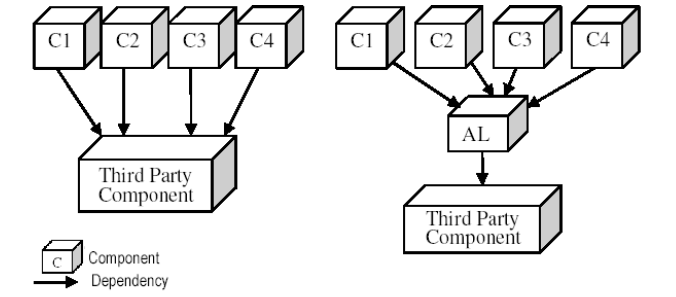

# Clase 1 - Introducción

## ¿Por qué este ramo?

Aumenta la **complejidad** del software actual.

Existe conocimiento de arquitecturas de **referencia**, **frameworks** y **patrones** para usar como base y mejorar la calidad de diseño.

Garantizar **calidad**, reducir costos y permitir **flexibilidad**

## Motivación

Típicamente los sistemas de desarrollo atienden intereses puntuales
* Lista de requisitos/requerimientos
* Modelo de dominio
* Desarrollo de software

Aparecen cambios
* Modificaciones
* Adaptaciones
* Extensiones
* Parches
* ...

Esto hace que se quede software inutilizado, repetido o que se generen muchas dependencias y no siempre funcionan correctamente

## Problemas de la Ingeniería de Software

Existen dos tipos de problemas:

### Accidentales

Errores ingresados por los desarrolladores

* Existe una solución... hay que encontrar una solución "elegante"
* Mejora de productividad
    * Programación y abstracciones: lenguajes de programación de alto nivel
    * Resultados de las decisiones de programación toma mucho tiempo
    * Programas heterogéneos
        * IDEs
        * Apoyo al desarrollo

### Esenciales

Problemas implícitos e intrínsecos dentro del diseño/solución

* Solo existen soluciones parciales
    * Complejidad
        * Crece de manera no lineal
    * Conformidad
        * Sistema operativo, hardware, ...
    * Cambiabilidad (adaptabilidad)
        * Nuevas aplicaciones, usuarios, máquinas, estándares, leyes, hardware, ...
    * Intangibilidad
        * No hay leyes físicas, no hay una percepción obvia

## Arquitectura de Software

Conjunto de las **principales** decisiones de diseño sobre el sistema
* Estructura
* Conducta
* Iteración
* Propiedades no funcionales

Son decisiones que afectan *todo el sistema*

* No se especifican detalles -de implementación- pero si los componentes que cargan con la responsabilidad de la implementación
    * Componentes de grano grande y sub-sistemas, no clases ni algoritmos

* Va del análisis a la implementación

* El objetivo es manejar la complejidad y cumplir con los *atributos de calidad*

* Tomar decisiones que afectan a todo el sistema

Considera:
* Elementos -> qué
* Forma -> cómo
* Lógica -> por qué

Involucra:
* Elementos a partir de los cuales se construye un sistema
* Interacciones entre los elementos
* Patrones que guían su composición
* Restricciones sobre esos patrones
* Abstracciones, de-composición, composición, estilo y estética

"La organización fundamental de un sistema se ve reflejada en sus componentes, relaciones entre ellos y el ambiente y los principios que gobiernan su diseño y evolución" (Recommended Practice for Architectural Description of Software-Intensive Systems ANSI/IEEE Std 1471-2000)

Captura la *estructura* del sistema en términos de componentes y cómo interactúan

Define las reglas de diseño y evolución globales al sistema

Componentes, módulos, objetos o cualquier otra unidad de software inter-relacionada

## Principios

* **Cohesión**
* **Acoplamiento**
* Consistencia
* YAGNI (you aren't going to need it)
* KISS (keep it simple and stupid)
* Calidad
* Testing
* Diseño (frameworks, patrones, etc)
* ...

### Cohesión

* La funcionalidad relacionada debe ir junta, dentro de un módulo
* Las partes dentro de un módulo deben trabajar juntas

### Acoplamiento

* Interdependencia entre módulos
* Ejemplo de tren: los vagones deben ser independientes

### Capas de abstracción

* Ninguno de los dos sistemas es mejor que el otro, hay que tener en cuenta los tradeoffs de cada approach

## Roles del arquitecto

* Juntar requisitos
* Documentar
* Diseñar
* Comunicar
* Liderar el desarrollo

Las mejores arquitecturas son producto de
* Solo una mente
* Un equipo pequeño y estructurado (*Rechtin, Systems Architecting: Creating & Building Complex Systems, 1991, p21*)

Todo proyecto debe tener exactamente un arquitecto identificable (un responsable)
* Para proyectos más grandes, el arquitecto principal debe/puede estar respaldado por un arquitecto o subequipo

### Habilidades esperadas

* Capacidad de desarrollo de software (experto)
* *Expertise* en el dominio (experto en el tema)
* Comunicador
* Estratega
* Consultor
* Líder
* Tecnólogo
* Estimador de costo
* Animador/Motivador
* Político
* Vendedor

### Arquitecto como desarrollador

Debe entender las dificultades del desarrollo de software
* Principios
* Métodos y técnicas
* Metodologías
* Herramientas

Debe entender las ramificaciones de las decisiones arquitectónicas
* No debe vivir en una "torre de marfil" (diseños extremadamente complejos)
* Restricciones (de implementación) de sus decisiones

### Arquitecto como experto del tema

No basta con que sea un buen programador

Problemas con el dominio del tema
* Madurez
* Estabilidad
* Usuarios y sistemas

Puede afectar de gran manera a la arquitectura diseñada y la implementación de la solución
* Capacidad de escalar
* Capacidad de evolución
* ...

Requiere de artefactos para entender el problema
* No la solución

### Arquitecto como estratega

Desarrollar una arquitectura "elegante" no es suficiente
* La tecnología es solo una parte de la solución
* La arquitectura debe ser adecuada para la organización

Debe ajustarse a la organización
* Estrategia de negocios
* A las prácticas del negocio
* A los ciclos de planificación
* Debe ajustarse (o funcionar bien) con los procesos del negocio

Debe estar consciente de la competencia
* Productos
* Estrategias
* Procesos

### Arquitecto como comunicador

Es casi la mitad del trabajo

Debe
* Escuchar las preocupaciones de los Stakeholders
* Explicar la arquitectura de la solución
* Negociar compromisos y fechas

Necesita las capacidades para
* Escribir bien
* Hablar (convencer)
* Presentar

### Arquitecto como líder

Debe ser un líder técnico
* En base a su conocimiento y sus logros
* Inspira respeto a través de sus ideales, *expertise*, palabras y acciones
* No puede apoyarse solo en su disposición en el organigrama

Asegurar que se sigan las reglas, guías y decisiones de diseño

Mejorar la productividad y calidad al agregar/incorporar
    * Nuevas ideas, soluciones y técnicas
    * Mentores y nuevas personas al proyecto

Tomar decisiones y ayudar en asegurar la implementación

### Arquitecto como tecnólogo

Entender los enfoques de desarrollo
* Basado en objetos y componentes

Entender las tecnologías fundamentales
* Redes y sistemas operativos
* Middleware
* Seguridad
* Bases de datos
* Interfaces gráficas (GUI)

Estar al día con las corrientes

Demostrar *expertise* en
* Modelar el sistema
* Análisis de trade-off de la arquitectura
* Amarrar requerimientos de sistema a la solución arquitectónica

### Arquitecto como estimador de costos

Entender las ramificaciones financieras de las decisiones arquitectónicas
* Green field vs Brown field
* Costo de adoptar COTS
* Costo de desarrollar para el re-uso
* Estabilidad financiera y posición de la compañía en el rubro

La solución tecnológica superior no siempre es la más apropiada
* Impacto en el costo y en el cronograma

Aproximaciones de estimaciones de costos son suficientes (en general)
* Se puede entrar en mayor detalle cuando las opciones se han reducido a un pequeño grupo

### Arquitecto como vendedor

Por las razones anteriores, el arquitecto debe vender:
* La visión general
* La solución tecnológica
* Principales propiedades arquitectónicas
* Principales propiedades del sistema que se obtendrá
* Perfil de costos y cronogramas
* Importancia de apegarse a la arquitectura

## Rol del equipo de arquitectura

* Definir la arquitectura de software
* Mantener la integridad de la arquitectura de software
* Explorar y mitigar los riesgos asociados al diseño
* Propones orden y contenidos de las iteraciones
* Coordinar y co-existir con otros equipos
* Asistir en las decisiones del proyecto
* Asistir en las definiciones del proyecto
